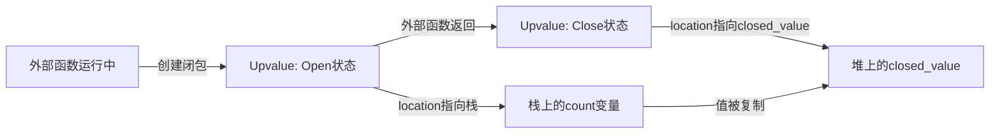
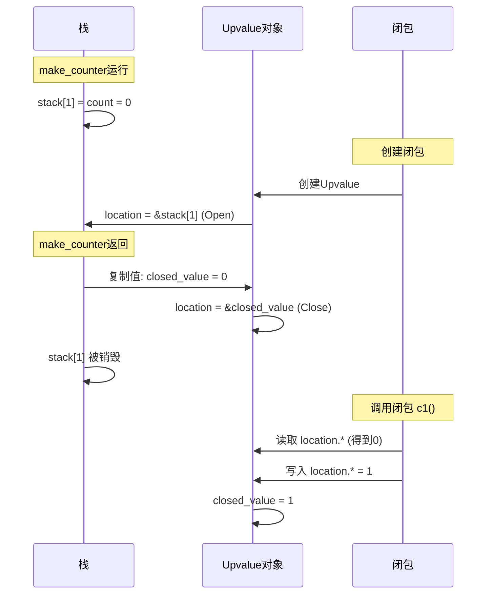

# Lua 闭包原理与 Zig 实现指南

## 摘要

本文用最简单直观的方式，从零开始解释 Lua 闭包的工作原理。通过一个完整的计数器例子，逐步揭示 Upvalue、Open/Close 状态转换等核心机制，帮助读者彻底理解闭包在虚拟机层面的实现细节。

---

## ⚠️ 重要说明：编译期 vs 运行期

**本文主要关注 VM Executor（运行期）的实现**，但会涉及一些编译期的概念。为了帮助理解，我们先明确两个阶段：

### 编译期（Compiler）
- **输入**：Lua 源代码
- **输出**：`ObjProto`（函数原型）
- **包含**：字节码、常量表、Upvalue 捕获规则（`UpvalueLoc`）
- **特点**：静态的、只读的、可共享的

### 运行期（VM Executor）
- **输入**：`ObjClosure`（闭包实例）
- **执行**：字节码解释执行
- **创建**：`ObjUpvalue`（Upvalue 对象）
- **特点**：动态的、实例化的、每个闭包独立的

### 关键理解

**在 VM Executor 中**：
- ✅ **所有函数都是 Closure**：即使是顶层函数，也会被创建为 `ObjClosure` 实例
- ✅ **Proto 已经存在**：编译期已经生成，executor 直接使用
- ✅ **关注运行期行为**：如何创建 Closure、如何捕获 Upvalue、如何管理状态转换

**本文的视角**：
- 主要关注：**运行期（VM Executor）的实现**
- 简要说明：编译期的概念（Proto、UpvalueLoc）是为了理解运行期行为
- 核心问题：**当 VM 执行 `CLOSURE` 指令时，发生了什么？**

---

## 引言：闭包要解决什么问题？

想象这样一个场景：

```lua
function make_counter()
    local count = 0  -- 局部变量
    return function()
        count = count + 1  -- 内部函数要访问外部函数的局部变量
        return count
    end
end

local c1 = make_counter()
print(c1())  -- 输出: 1
print(c1())  -- 输出: 2
```

**问题来了**：
- `make_counter` 函数执行完后，它的局部变量 `count` 应该被销毁（栈帧被弹出）
- 但是返回的闭包 `c1` 还要继续使用 `count` 变量
- **怎么办？**

这就是闭包要解决的核心问题：**如何让内部函数在外部函数返回后，还能访问外部函数的局部变量？**

---

## 第一部分：理解闭包的基本结构

### 1.1 闭包 = 函数代码 + 捕获的变量

**运行期视角**：在 VM Executor 中，所有函数都是 Closure！

闭包由两部分组成：

```zig
const ObjClosure = struct {
    proto: *ObjProto,        // 函数代码（字节码）- 编译期已生成
    upvalues: []?*ObjUpvalue, // 捕获的外部变量 - 运行期创建
};
```

**简单理解**：
- `proto`：函数的"代码模板"（编译期生成，所有相同函数的实例共享）
- `upvalues`：这个闭包"记住"的外部变量（运行期创建，每个闭包实例独有）

**重要**：即使是顶层函数（如 `main`），在 VM 中也会被创建为 `ObjClosure` 实例。当函数执行时，`frame.closure` 指向的就是这个 Closure 实例。

### 1.2 为什么需要 Proto？

**编译期视角**：
```lua
local f1 = function() return x end
local f2 = function() return x end
```

这两个函数**代码相同**，但可能捕获**不同的 `x`**。

**运行期视角**：
- **Proto**：编译期已生成，存储"代码"（所有实例共享）
- **Closure**：运行期创建，存储"代码 + 捕获的变量"（每个实例独立）

**在 VM Executor 中**：
- Proto 已经存在（编译期产物）
- Executor 的工作是：根据 Proto 创建 Closure，并填充 `upvalues` 数组

---

## 第二部分：Upvalue 是什么？

### 2.1 问题的本质

当内部函数要访问外部函数的局部变量时，这个变量就变成了 **Upvalue**（上值）。

**关键问题**：这个变量应该存在哪里？

### 2.2 两种存储位置

**重要区分**：
- **Upvalue 对象本身**：始终在堆上（`ObjUpvalue` 结构体）
- **被捕获的变量值**：可能从栈"搬家"到堆（存储在 Upvalue 对象的 `closed_value` 字段中）

#### 方案 A：一直存在栈上 ❌
```
问题：外部函数返回后，栈帧被销毁，变量就没了！
```

#### 方案 B：一开始就存在堆上 ❌
```
问题：外部函数访问自己的局部变量也要间接寻址，性能差！
```

#### 方案 C：Lua 的方案 ✅
```
1. 外部函数运行时：变量值在栈上，Upvalue对象的location指向栈（性能好）
2. 外部函数返回时：把变量值"搬家"到堆上（复制到Upvalue对象的closed_value），location指向堆（保证闭包能继续用）
```

这就是 **Upvalue 的 Open/Close 机制**！

---

## 第三部分：Upvalue 的 Open/Close 状态详解

### 3.1 用"租房"比喻理解

想象 `count` 变量是一间房子：

**Open 状态（开放状态）**：
- 房子在"栈上"（临时地址）
- Upvalue 是一把钥匙，指向这个临时地址
- 外部函数和闭包都能用这把钥匙开门
- **特点**：外部函数修改房子，闭包能立即看到

**Close 状态（关闭状态）**：
- 外部函数要"退房"了（栈帧销毁）
- 在退房前，Upvalue 把房子里的东西**全部复制**到自己家里（堆上）
- 然后把钥匙指向自己的家
- **特点**：外部函数已经不存在了，但闭包还能继续用

### 3.2 Upvalue 的数据结构

```zig
const ObjUpvalue = struct {
    location: *LuaValue,     // 一把"钥匙"（指针）
    closed_value: LuaValue,  // Upvalue自己的"家"（堆上存储）
    next_open: ?*ObjUpvalue, // 链表：LuaVM管理所有Open状态的Upvalue
};
```

**关键理解**：
- `location` 是**指针**（可以理解为"钥匙"），指向实际存储值的地方
- Open 时：`location` 指向栈上的变量（值在栈上）
- Close 时：`location` 指向自己的 `closed_value`（值在堆上，Upvalue 对象内部）
- **重要**：之后无论是 Open 还是 Close，代码都只通过 `location.*` 访问值，无需关心状态

### 3.3 完整的状态转换图



---

## 第四部分：完整的例子追踪

让我们用 `make_counter` 例子，一步步追踪内存的变化：

### 4.1 步骤 1：外部函数开始运行

```lua
function make_counter()
    local count = 0  -- 栈上分配
    return function() ... end
end
```

**内存状态**：
```
[栈]
stack[1] = count = 0  ← 局部变量在这里
```

### 4.2 步骤 2：创建闭包（Open 状态）

```lua
return function()
    count = count + 1  -- 捕获 count
    return count
end
```

**发生了什么**：
1. VM 发现内部函数要捕获 `stack[1]` 的 `count`
2. 创建一个 `ObjUpvalue` 对象（在堆上）
3. 设置 `upvalue.location = &stack[1]`（指向栈）
4. 状态：**Open**

**内存状态**：
```
[栈]                    [堆]
stack[1] = 0  ←─────────┐
                        │
                        └──→ ObjUpvalue {
                                location: &stack[1]  ← 指向栈
                                closed_value: <未使用>
                            }
```

**关键点**：
- `count` 的值（0）**还在栈上**
- Upvalue 只是一个"指针"，指向栈上的值
- 如果外部函数修改 `count`，闭包能立即看到

### 4.3 步骤 3：外部函数返回（Close 状态）

```lua
return function() ... end  -- 返回闭包
-- make_counter 函数结束
```

**发生了什么**：
1. VM 检测到 `make_counter` 要返回了
2. 调用 `closeUpvalues` 函数
3. 对于所有指向当前栈帧的 Upvalue：
   - **步骤 3.1**：把栈上的值（0）**复制**到 `upvalue.closed_value`
   - **步骤 3.2**：修改 `upvalue.location = &upvalue.closed_value`（指向自己）
   - **步骤 3.3**：从 Open 链表中移除

**内存状态变化**：

**Before（Open）**：
```
[栈]                    [堆]
stack[1] = 0  ←─────────┐
                        │
                        └──→ ObjUpvalue {
                                location: &stack[1]  ← 指向栈
                                closed_value: <未使用>
                            }
```

**After（Closed）**：
```
[栈]                    [堆]
stack[1] = <销毁>        ObjUpvalue {
                            location: &closed_value  ← 指向自己
                            closed_value: 0  ← 值被复制到这里
                        }
```

**关键点**：
- 栈上的 `count` 被销毁了
- 但值（0）已经被**复制**到 Upvalue 的 `closed_value` 中
- `location` 指针现在指向 `closed_value`，而不是栈

### 4.4 步骤 4：闭包被调用

```lua
local c1 = make_counter()
print(c1())  -- 调用闭包
```

**发生了什么**：
1. 闭包执行 `count = count + 1`
2. 通过 `upvalue.location.*` 访问值
3. 因为 `location` 指向 `closed_value`，所以读取的是 `closed_value` 中的 0
4. 执行 `+1`，把结果 1 写回 `closed_value`

**内存状态**：
```
[堆]
ObjUpvalue {
    location: &closed_value
    closed_value: 1  ← 值被修改了
}
```

### 4.5 完整流程图



---

## 第五部分：回答核心疑问

### 5.1 变量到底存在哪里？

**答案**：变量可能存在于两个地方，取决于状态：

| 状态 | 变量存储位置 | Upvalue.location 指向 |
|------|-------------|---------------------|
| **Open** | 栈上（`stack[i]`） | 栈上的变量（`&stack[i]`） |
| **Closed** | 堆上（`upvalue.closed_value`） | 自己的 `closed_value`（`&closed_value`） |

**关键理解**：
- Upvalue **对象本身**始终在堆上
- 但**变量的值**会从栈"搬家"到堆
- `location` 指针会跟着"搬家"而改变指向

### 5.2 Close 操作"移动"的是什么？

**答案**：移动的是**值的副本**，不是整个对象。

**详细过程**：
```zig
// 步骤 1：复制值
upvalue.closed_value = upvalue.location.*;  // 从栈复制到堆

// 步骤 2：修改指针
upvalue.location = &upvalue.closed_value;   // 指向自己的存储

// 步骤 3：栈上的原始值会被销毁（函数返回）
```

**重要**：
- 复制的是 `LuaValue` 的值（**不是 Upvalue 对象本身**）
- Upvalue 对象本身始终在堆上，不会被移动
- 如果是基础类型（Number），直接复制数字
- 如果是对象类型（Table），复制的是指针（Table 对象本身还在堆上）

### 5.3 为什么需要 Open/Close 两种状态？

**性能优化**：

| 场景 | 如果只用 Closed | Lua 的方案（Open→Close） |
|------|----------------|------------------------|
| 外部函数访问局部变量 | 需要间接寻址（慢） | 直接访问栈（快） |
| 闭包访问变量 | 间接寻址 | 间接寻址（相同） |
| 函数返回时 | 无需操作 | 需要复制值（一次开销） |

**结论**：Lua 选择用"返回时的一次复制"换取"运行时的零开销访问"。

---

## 第六部分：多个闭包共享同一个变量

### 6.1 共享场景

```lua
function outer()
    local x = 10
    local f1 = function() return x end
    local f2 = function() return x end
    return f1, f2
end
```

**问题**：`f1` 和 `f2` 都捕获了 `x`，它们应该共享同一个 Upvalue 吗？

**答案**：是的！它们应该共享，这样修改 `x` 时，两个闭包都能看到。

### 6.2 如何实现共享？

VM 维护一个 `open_upvalues` **全局链表**，记录所有 Open 状态的 Upvalue：

```zig
const LuaVM = struct {
    open_upvalues: ?*ObjUpvalue,  // 全局链表头
    // ...
};
```

**创建闭包时的逻辑**：

```lua
local f1 = function() return x end  -- 创建闭包1
```

1. VM 调用 `captureUpvalue(&stack[i])` 捕获 `x`
2. 在 `vm.open_upvalues` **全局链表**中查找是否已有 Upvalue 指向 `&stack[i]`
3. **如果找到**：返回已有的 Upvalue 指针
4. **如果没找到**：创建新的 Upvalue，加入全局链表

```lua
local f2 = function() return x end  -- 创建闭包2
```

5. 再次调用 `captureUpvalue(&stack[i])`
6. 在全局链表中**找到同一个 Upvalue**（因为指向同一个栈位置）
7. 返回**同一个 Upvalue 指针**

**结果**：
- `f1.upvalues[0]` 和 `f2.upvalues[0]` 都指向**同一个 Upvalue 对象**
- 修改 `x` 时，两个闭包都能看到（因为它们共享同一个 Upvalue）

**内存布局**：

```mermaid
graph TD
    subgraph VM[VM全局]
        VM_LIST[vm.open_upvalues<br>→ Upvalue_A]
    end

    subgraph Closure1[Closure f1]
        C1_ARRAY[upvalues: [&Upvalue_A]]
    end

    subgraph Closure2[Closure f2]
        C2_ARRAY[upvalues: [&Upvalue_A]]
    end

    subgraph Heap[堆]
        UPVALUE_A[ObjUpvalue_A<br>location: &stack[1]]
    end

    VM_LIST --> UPVALUE_A
    C1_ARRAY --> UPVALUE_A
    C2_ARRAY --> UPVALUE_A
```

**关键点**：
- `vm.open_upvalues` 是**全局链表**，用于查找和共享
- `closure.upvalues` 是**数组**，存储闭包自己的 Upvalue 指针
- 多个闭包的 `upvalues` 数组可以包含**相同的指针**（共享同一个 Upvalue 对象）

---

## 第七部分：完整的内存布局图

### 7.1 一个完整的例子

```lua
function make_counter()
    local count = 0
    return function()
        count = count + 1
        return count
    end
end

local c1 = make_counter()
local c2 = make_counter()
```

### 7.2 内存布局（Close 后）

```mermaid
graph TD
    subgraph Stack[栈 - 已销毁make_counter的栈帧]
        STACK_NOTE[make_counter的栈帧已被销毁]
    end

    subgraph Heap[堆]
        CLOSURE_C1[Closure c1<br>proto: make_counter_proto<br>upvalues: [&Upvalue_A]]
        CLOSURE_C2[Closure c2<br>proto: make_counter_proto<br>upvalues: [&Upvalue_B]]
        PROTO[(make_counter_proto<br>共享的代码模板)]
        UPVALUE_A[ObjUpvalue_A<br>location: &closed_value<br>closed_value: 2]
        UPVALUE_B[ObjUpvalue_B<br>location: &closed_value<br>closed_value: 1]
    end

    CLOSURE_C1 --> PROTO
    CLOSURE_C2 --> PROTO
    CLOSURE_C1 --> UPVALUE_A
    CLOSURE_C2 --> UPVALUE_B
    UPVALUE_A --> UPVALUE_A
    UPVALUE_B --> UPVALUE_B
```

**关键点**：
1. `c1` 和 `c2` **共享**同一个 `proto`（代码模板）
2. 但拥有**独立的** `Upvalue` 对象（`Upvalue_A` 和 `Upvalue_B`）
3. 每个 Upvalue 的 `closed_value` 存储独立的值
4. 栈上的原始变量已经被销毁

---

## 第八部分：Zig 代码实现

### 8.1 数据结构详解

#### 8.1.1 ObjUpvalue：Upvalue 的堆对象

```zig
// Upvalue 对象（堆上分配）
const ObjUpvalue = struct {
    header: GCObject,
    location: *LuaValue,      // 指针：Open时指向栈，Close时指向closed_value
    closed_value: LuaValue,    // 堆上存储：Close时值的副本存在这里
    next_open: ?*ObjUpvalue,   // 链表指针：用于VM全局管理
};
```

**关键理解**：
- `ObjUpvalue` **本身不是链表**，它是一个对象
- 但它有一个 `next_open` 字段，**可以**形成链表
- 这个链表是 **VM 全局管理的**，不是闭包管理的

#### 8.1.2 两个不同的数据结构

**问题**：为什么 `ObjUpvalue` 有 `next_open`，而 `ObjClosure` 又有 `upvalues` 数组？

**答案**：它们用途不同！

```zig
// VM 全局状态
const VM = struct {
    open_upvalues: ?*ObjUpvalue,  // 全局链表：所有Open状态的Upvalue
    // ...
};

// 闭包
const ObjClosure = struct {
    proto: *ObjProto,
    upvalues: []?*ObjUpvalue,  // 数组：这个闭包捕获的所有Upvalue
    // 注意：[]?*ObjUpvalue 表示"可空指针的切片"
    // ? 表示指针可能为 null（某些 upvalue 槽位可能未使用）
};
```

**用途对比**：

| 数据结构 | 用途 | 谁管理 | 生命周期 |
|---------|------|--------|---------|
| `vm.open_upvalues` (链表) | VM 全局管理所有 Open 状态的 Upvalue，用于查找和关闭 | VM | 全局 |
| `closure.upvalues` (数组) | 存储这个闭包捕获的所有 Upvalue 指针 | 闭包 | 随闭包 |

**性能说明**：
- 本实现使用线性链表（未排序），结构简单，查找复杂度 O(n)
- Lua 官方实现会按栈地址排序，可以在遍历时提前终止，属于进一步优化
- "快速"是相对于"遍历所有闭包"而言：只需查找 Open 状态的集合，而不是所有闭包

#### 8.1.3 为什么需要两个？——两个管理步骤

**关键理解**：这是**两个不同的管理步骤**，各司其职！

**步骤 1：VM 管理（全局链表）**
- **时机**：创建闭包时、函数返回时
- **操作**：`captureUpvalue` 和 `closeUpvalues`
- **目的**：查找共享、关闭 Upvalue
- **数据结构**：`vm.open_upvalues` 链表

**步骤 2：闭包管理（数组）**
- **时机**：创建闭包时、访问 Upvalue 时
- **操作**：存储指针、通过索引访问
- **目的**：闭包访问自己捕获的变量
- **数据结构**：`closure.upvalues` 数组

**完整流程示例**：

```lua
function outer()
    local x = 10
    local f1 = function() return x end  -- 创建闭包1
    local f2 = function() return x end  -- 创建闭包2
    return f1, f2
end
```

**创建 `f1` 时**：
1. **VM 步骤**：调用 `captureUpvalue(&stack[1])`
   - 在 `vm.open_upvalues` 链表中查找 → 没找到
   - 创建新的 `Upvalue_A`
   - 将 `Upvalue_A` 加入 `vm.open_upvalues` 链表
   - 返回 `Upvalue_A` 指针
2. **闭包步骤**：将 `Upvalue_A` 指针存入 `f1.upvalues[0]`

**创建 `f2` 时**：
1. **VM 步骤**：调用 `captureUpvalue(&stack[1])`
   - 在 `vm.open_upvalues` 链表中查找 → **找到了 `Upvalue_A`**（因为指向同一个栈位置）
   - 返回**同一个** `Upvalue_A` 指针（实现共享）
2. **闭包步骤**：将 `Upvalue_A` 指针存入 `f2.upvalues[0]`

**函数返回时**：
1. **VM 步骤**：调用 `closeUpvalues(&stack[1])`
   - 遍历 `vm.open_upvalues` 链表
   - 找到 `Upvalue_A`（指向 `stack[1]`）
   - 复制值到 `closed_value`
   - 修改 `location` 指针
   - **从 `vm.open_upvalues` 链表中移除**（但 Upvalue 对象还在）
2. **闭包步骤**：无需操作，`f1.upvalues[0]` 和 `f2.upvalues[0]` 仍然指向 `Upvalue_A`

**结果**：
- `vm.open_upvalues` 链表：`Upvalue_A` 已被移除（因为已 Close）
- `f1.upvalues[0]` 和 `f2.upvalues[0]`：仍然指向 `Upvalue_A`（闭包仍能访问）

**为什么这样设计？**

| 设计选择 | 如果只用闭包数组 | Lua 的方案（VM链表+闭包数组） |
|---------|----------------|---------------------------|
| **查找共享** | 需要遍历所有闭包（慢） | 在全局链表中查找（快） |
| **关闭操作** | 需要找到所有引用该 Upvalue 的闭包（复杂） | 直接遍历全局链表（简单） |
| **闭包访问** | 直接通过数组索引（快） | 直接通过数组索引（快） |

**结论**：用 VM 的全局链表处理"查找和关闭"，用闭包的数组处理"存储和访问"，各司其职，效率最高！

#### 8.1.4 内存布局示意图（Close 后仍共享）

```mermaid
graph TD
    subgraph VM[VM全局状态]
        VM_OPEN_LIST[vm.open_upvalues<br>链表头]
    end

    subgraph Closure1[Closure f1]
        C1_UPVALUES[upvalues: [&Upvalue_A]]
    end

    subgraph Closure2[Closure f2]
        C2_UPVALUES[upvalues: [&Upvalue_A]]
    end

    subgraph Heap[堆上的Upvalue对象]
        UPVALUE_A[ObjUpvalue_A<br>location: &stack[1]<br>next_open: &Upvalue_B]
        UPVALUE_B[ObjUpvalue_B<br>location: &stack[2]<br>next_open: null]
    end

    VM_OPEN_LIST --> UPVALUE_A
    UPVALUE_A --> UPVALUE_B
    C1_UPVALUES --> UPVALUE_A
    C2_UPVALUES --> UPVALUE_A
```

**关键点**：
1. `vm.open_upvalues` 是**全局链表**，所有 Open 状态的 Upvalue 都在里面
2. `closure.upvalues` 是**数组**，每个闭包存储它捕获的 Upvalue 指针
3. 多个闭包可以**共享**同一个 Upvalue（如 `f1` 和 `f2` 都指向 `Upvalue_A`）
4. 当 Upvalue 被 Close 后，会从 `vm.open_upvalues` 链表中移除，但仍在 `closure.upvalues` 数组中
5. **重要**：Close 后，多个闭包仍然共享同一个 Upvalue 对象，只是该对象的 `location` 从指向栈改为指向 `closed_value`

### 8.2 创建 Upvalue（Open 状态）

**注意**：以下代码为简化版伪代码，展示核心逻辑。实际实现请参考 `mini_lua_vm_v2.zig`。

```zig
fn captureUpvalue(self: *VM, local_ptr: *LuaValue) !*ObjUpvalue {
    // 步骤1：在全局链表中查找是否已有Upvalue指向这个栈位置
    var current = self.open_upvalues;  // 从链表头开始
    while (current) |upval| {
        if (upval.location == local_ptr) {
            return upval;  // 找到了！复用已有的Upvalue（实现共享）
        }
        current = upval.next_open;  // 遍历链表（线性查找）
    }
    
    // 步骤2：没找到，创建新的Upvalue对象（在堆上）
    // 实际代码：self.maybeCollectGarbage();
    const upval = try self.allocator.create(ObjUpvalue);
    upval.header = GCObject{ .next = self.objects, .obj_type = .Upvalue, .marked = false };
    self.objects = &upval.header;
    
    upval.location = local_ptr;  // 指向栈上的变量
    upval.closed_value = LuaValue{ .Nil = {} };
    
    // 步骤3：将新Upvalue插入全局链表的头部
    upval.next_open = self.open_upvalues;
    self.open_upvalues = upval;
    
    return upval;  // 返回Upvalue指针，闭包会把它存入upvalues数组
}
```

**关键理解**：
- `captureUpvalue` 返回的 `*ObjUpvalue` 会被存入 `closure.upvalues` 数组
- 同时，这个 Upvalue 也被加入 `vm.open_upvalues` 全局链表
- **两个数据结构都指向同一个 Upvalue 对象**

### 8.3 CLOSURE 指令：处理嵌套闭包

**问题**：当创建闭包时，如何知道要捕获的是"父函数的局部变量"还是"父函数的 Upvalue"？

**答案**：通过 `UpvalueLoc.is_local` 字段区分！

```zig
// CLOSURE 指令的处理逻辑（来自 mini_lua_vm_v2.zig）
.CLOSURE => {
    // 关键理解：frame 是当前执行的栈帧，frame.closure 是当前帧对应的闭包
    // 当执行 CLOSURE 指令时，当前帧就是"父函数"的帧
    // 所以 frame.closure 就是"父函数的闭包"
    
    var frame = &self.frames[self.frame_count - 1];  // 当前帧（父函数的帧）
    const sub_proto = frame.closure.proto.protos[bx];  // 子函数的原型
    const new_closure = try self.newClosure(sub_proto);  // 创建子函数的闭包
    
    // 遍历子函数的 Upvalue 捕获规则
    for (sub_proto.upvalues, 0..) |up_loc, i| {
        if (up_loc.is_local) {
            // 情况1：捕获父函数的局部变量
            // 从当前栈帧的局部变量中捕获
            const slot_ptr = &self.stack[frame.slots + up_loc.index];
            new_closure.upvalues[i] = try self.captureUpvalue(slot_ptr);
            // ↑ 调用 captureUpvalue，创建或复用 Upvalue，加入 vm.open_upvalues
        } else {
            // 情况2：捕获父函数的 Upvalue（嵌套闭包）
            // 直接从父闭包的 upvalues 数组中继承
            new_closure.upvalues[i] = frame.closure.upvalues[up_loc.index].?;
            // ↑ frame.closure 是父函数的闭包
            // ↑ frame.closure.upvalues[up_loc.index] 是父函数捕获的 Upvalue
            // ↑ 直接复制指针，不需要创建新的 Upvalue
        }
    }
}
```

**关键理解：`frame.closure` 的含义**

- `frame`：当前执行的栈帧（`CallFrame`），代表正在执行的函数调用
- `frame.closure`：当前帧对应的闭包，也就是**正在执行这个帧的函数**
- 当执行 `CLOSURE` 指令时：
  - 当前帧是"父函数"的帧
  - `frame.closure` 就是"父函数的闭包"
  - 正在创建的是"子函数"的闭包（`new_closure`）

**示例**：

```lua
function outer()
    function inner()  -- 执行 CLOSURE 指令创建 inner
    end
end
```

**运行期视角**：当 `outer` 执行到 `CLOSURE` 指令时：
- `frame` = `outer` 的栈帧（当前正在执行的函数）
- `frame.closure` = `outer` 的 Closure 实例（**在 VM 中，所有函数都是 Closure**）
- `new_closure` = 正在创建的 `inner` 闭包（新的 Closure 实例）
- `frame.closure.upvalues` = `outer` 闭包捕获的 Upvalue 数组

**关键理解**：
- 在 VM Executor 中，`outer` 本身就是一个 `ObjClosure` 实例
- 当 `outer` 执行时，`frame.closure` 指向的就是这个 Closure 实例
- 创建 `inner` 时，需要从 `outer` 的 `upvalues` 数组中继承 Upvalue

**为什么需要 `else` 分支？——嵌套闭包场景**

考虑这个例子：

```lua
function outer()
    local x = 10  -- outer 的局部变量
    function middle()
        local y = 20  -- middle 的局部变量
        function inner()
            return x + y  -- inner 需要捕获 x 和 y
        end
        return inner
    end
    return middle
end
```

**分析 `inner` 函数的捕获**：
- `x`：不是 `middle` 的局部变量，而是 `middle` 从 `outer` 捕获的 Upvalue
- `y`：是 `middle` 的局部变量

**编译期分析**（`inner` 的 `proto.upvalues` - **编译期已生成，运行期直接使用**）：
- `upvalues[0]` = `{is_local=false, index=0}` → 捕获父闭包（`middle`）的 `upvalues[0]`（即 `x`）
- `upvalues[1]` = `{is_local=true, index=0}` → 捕获父栈帧的局部变量 `y`

**运行期视角**：这些规则已经在 Proto 中，VM Executor 只需要按照规则执行即可。

**运行时处理**（创建 `inner` 闭包时）：
1. **处理 `x`**（`is_local=false`）：
   - 进入 `else` 分支
   - 从 `middle.upvalues[0]` 获取 `x` 的 Upvalue 指针
   - 直接复制给 `inner.upvalues[0]`
   - **不需要创建新的 Upvalue**，因为 `x` 已经被 `middle` 捕获了

2. **处理 `y`**（`is_local=true`）：
   - 进入 `if` 分支
   - 从栈上捕获 `middle` 的局部变量 `y`
   - 调用 `captureUpvalue`，创建或复用 Upvalue
   - 存入 `inner.upvalues[1]`

**关键理解**：
- `is_local=true`：捕获父函数的**局部变量**（在栈上）→ 需要 `captureUpvalue`
- `is_local=false`：捕获父函数的**Upvalue**（已经在堆上）→ 直接继承指针

**为什么不能都用 `captureUpvalue`？**
- 如果 `x` 已经被 `middle` 捕获为 Upvalue（可能在堆上），就不能再从栈上捕获
- 需要从 `middle.upvalues` 数组中继承，保持引用链的连续性

#### 8.3.1 多层嵌套的理论机制

**问题**：如果嵌套更多层，比如 4 层、5 层，如何获取 Upvalue？

**答案**：通过**递归继承链**！每一层闭包都从父闭包的 `upvalues` 数组中继承。

**多层嵌套示例**：

```lua
function level1()
    local a = 1
    function level2()
        local b = 2
        function level3()
            local c = 3
            function level4()
                return a + b + c  -- 需要捕获 a, b, c
            end
            return level4
        end
        return level3
    end
    return level2
end
```

**编译期分析**（`level4` 的 `proto.upvalues` - **编译期已生成，运行期直接使用**）：

编译器会分析 `level4` 需要捕获哪些变量，以及这些变量在**直接父函数**（`level3`）中的位置。**在 VM Executor 中，这些规则已经在 Proto 中，只需要按照规则执行。**

- `a`：不是 `level3` 的局部变量，是 `level3` 从 `level2` 继承的 Upvalue
  - `upvalues[0]` = `{is_local=false, index=0}` → 从 `level3.upvalues[0]` 继承
- `b`：不是 `level3` 的局部变量，是 `level3` 从 `level2` 继承的 Upvalue
  - `upvalues[1]` = `{is_local=false, index=1}` → 从 `level3.upvalues[1]` 继承
- `c`：是 `level3` 的局部变量
  - `upvalues[2]` = `{is_local=true, index=0}` → 从栈上捕获 `level3` 的局部变量 `c`

**运行时处理**（创建 `level4` 闭包时）：

```zig
for (level4_proto.upvalues, 0..) |up_loc, i| {
    if (up_loc.is_local) {
        // c: 从栈上捕获 level3 的局部变量
        new_closure.upvalues[i] = try self.captureUpvalue(&stack[level3_frame.slots + 0]);
    } else {
        // a 和 b: 从 level3.upvalues 数组中继承
        new_closure.upvalues[i] = level3_closure.upvalues[up_loc.index].?;
    }
}
```

**继承链的构建过程**：

让我们追踪 `a` 的完整继承链：

1. **`level2` 创建时**：
   - `a` 是 `level1` 的局部变量（在栈上）
   - `level2` 的 `proto.upvalues[0]` = `{is_local=true, index=0}`
   - 运行时：调用 `captureUpvalue(&stack[level1_frame.slots + 0])`
   - 创建 `Upvalue_A`，存入 `level2.upvalues[0]`

2. **`level3` 创建时**：
   - `a` 不是 `level2` 的局部变量，是 `level2` 的 Upvalue
   - `level3` 的 `proto.upvalues[0]` = `{is_local=false, index=0}`
   - 运行时：从 `level2.upvalues[0]` 继承 `Upvalue_A`
   - 直接复制指针，存入 `level3.upvalues[0]`

3. **`level4` 创建时**：
   - `a` 不是 `level3` 的局部变量，是 `level3` 的 Upvalue
   - `level4` 的 `proto.upvalues[0]` = `{is_local=false, index=0}`
   - 运行时：从 `level3.upvalues[0]` 继承 `Upvalue_A`
   - 直接复制指针，存入 `level4.upvalues[0]`

**关键理解**：

```
level1 (栈上) → level2.upvalues[0] → level3.upvalues[0] → level4.upvalues[0]
     a              Upvalue_A            (继承指针)          (继承指针)
```

**理论机制总结**：

1. **编译期**：编译器只关心**直接父函数**，分析变量在直接父函数中是"局部变量"还是"Upvalue"
2. **运行期**：通过 `is_local` 标志决定：
   - `true`：从栈上捕获（调用 `captureUpvalue`）
   - `false`：从父闭包的 `upvalues` 数组继承（直接复制指针）
3. **继承链**：每一层都从父层继承，形成一条引用链，最终指向最初捕获的 Upvalue 对象

**无论嵌套多少层，机制都一样**：
- 每一层只关心自己的直接父函数
- 通过 `is_local` 标志区分"局部变量"和"Upvalue"
- 如果是 Upvalue，就从父闭包的数组中继承
- 最终所有层都指向同一个 Upvalue 对象（如果捕获的是同一个变量）

### 8.4 关闭 Upvalue（Close 状态）

**注意**：以下代码为简化版伪代码，展示核心逻辑。实际实现请参考 `mini_lua_vm_v2.zig`。

```zig
fn closeUpvalues(self: *VM, last_slot_ptr: *LuaValue) void {
    // 这是 VM 的管理步骤：只操作全局链表
    var current = self.open_upvalues;  // 从全局链表头开始
    var prev: ?*ObjUpvalue = null;
    
    while (current) |upval| {
        // 检查这个Upvalue是否指向即将销毁的栈帧
        // 关键：通过比较指针地址判断
        // 假设栈向高地址增长，last_slot_ptr 是栈帧的起始地址
        // 如果 upval.location >= last_slot_ptr，说明它指向当前栈帧内的变量
        if (@intFromPtr(upval.location) >= @intFromPtr(last_slot_ptr)) {
            // 步骤1：复制值到closed_value（Upvalue对象本身在堆上，closed_value也在堆上）
            upval.closed_value = upval.location.*;
            
            // 步骤2：修改指针指向自己的closed_value
            upval.location = &upval.closed_value;
            
            // 步骤3：从全局Open链表中移除（VM管理步骤）
            const next = upval.next_open;
            if (prev) |p| {
                p.next_open = next;  // 从链表中移除
            } else {
                self.open_upvalues = next;  // 更新链表头
            }
            current = next;
            // 注意：这里只从VM的链表中移除，不操作闭包的数组！
        } else {
            prev = upval;
            current = upval.next_open;
        }
    }
}
```

**关键理解**：
- **这是 VM 的管理步骤**：只操作 `vm.open_upvalues` 全局链表
- **不操作闭包数组**：`closeUpvalues` 函数**不会**修改任何 `closure.upvalues` 数组
- Upvalue 对象**仍然存在**，仍在所有引用它的 `closure.upvalues` 数组中
- 闭包仍然可以通过 `closure.upvalues[i]` 访问这个 Upvalue（只是状态从 Open 变成了 Close）

**两个步骤的分离**：

```zig
// 步骤1：VM 管理（在 RETURN 指令中调用）
closeUpvalues(&stack[last_slot]);  // 只操作 vm.open_upvalues 链表

// 步骤2：闭包管理（无需操作，数组中的指针仍然有效）
// closure.upvalues[0] 仍然指向同一个 Upvalue 对象
// 只是这个 Upvalue 的状态从 Open 变成了 Close
```

### 8.5 访问 Upvalue（无需关心状态）

```zig
// 读取Upvalue
fn getUpvalue(upval: *ObjUpvalue) LuaValue {
    return upval.location.*;  // 无论Open还是Close，location都指向正确的位置
}

// 写入Upvalue
fn setUpvalue(upval: *ObjUpvalue, value: LuaValue) void {
    upval.location.* = value;  // 无论Open还是Close，都能正确写入
}
```

**关键设计**：通过 `location` 指针的抽象，访问代码无需关心 Upvalue 是 Open 还是 Close！

---

## 第九部分：总结与核心要点

### 9.0 运行期视角总结

**本文主要关注 VM Executor（运行期）的实现**：

| 概念 | 编译期 | 运行期（VM Executor） |
|------|--------|---------------------|
| **函数** | Proto（函数原型） | Closure（闭包实例） |
| **所有函数** | 都是 Proto | **都是 Closure** |
| **捕获规则** | `UpvalueLoc`（编译期分析） | 已存在 Proto 中，直接使用 |
| **Upvalue 对象** | 不存在 | `ObjUpvalue`（运行期创建） |
| **执行时** | - | `frame.closure` 指向 Closure 实例 |

**关键理解**：
- 在 VM Executor 中，**所有函数都是 Closure**
- Proto 是编译期产物，运行期已经存在
- Executor 的工作是：根据 Proto 创建 Closure，管理 Upvalue 的生命周期

### 9.1 核心概念速记

| 概念 | 简单理解 |
|------|---------|
| **Proto** | 函数的"代码模板"，所有实例共享 |
| **Closure** | 函数的"实例" = 代码模板 + 捕获的变量 |
| **Upvalue** | 被闭包捕获的外部变量 |
| **Open 状态** | 变量还在栈上，Upvalue 指向栈 |
| **Close 状态** | 变量已复制到堆上，Upvalue 指向自己的存储 |

### 9.2 关键机制

1. **延迟迁移**：变量默认在栈上，只在必要时（函数返回）才复制到堆
2. **指针抽象**：通过 `location` 指针，访问代码无需关心状态（之后无论是 Open 还是 Close，代码都只通过 `location.*` 访问值）
3. **共享优化**：多个闭包捕获同一变量时，**始终共享同一个 Upvalue 对象**（无论 Open 还是 Close）

### 9.3 两个管理步骤速记

**核心**：VM 管理全局链表（查找/关闭），闭包管理数组（存储/访问）。详见 8.1.3 节的完整流程示例。

### 9.4 记忆口诀

- **Open = 开放 = 变量还在栈上，大家都能用**
- **Close = 关闭 = 变量搬到堆上，只有闭包能用**
- **location = 钥匙 = 指向实际存储值的地方**

---

## 第十部分：为什么闭包用起来简单，实现起来复杂？

### 10.1 使用者的视角：简单直观

对于 Lua 程序员来说，闭包用起来非常简单：

```lua
function make_counter()
    local count = 0
    return function()
        count = count + 1
        return count
    end
end

local c = make_counter()
print(c())  -- 输出: 1
print(c())  -- 输出: 2
```

**就这么简单！** 程序员只需要：
- 写一个函数
- 返回一个内部函数
- 内部函数可以访问外部变量

**完全不需要关心**：
- Upvalue 是什么
- Open/Close 状态
- 栈和堆的迁移
- 全局链表和数组的管理

### 10.2 实现者的视角：复杂但必要

但对于 VM 实现者来说，需要处理：

1. **生命周期管理**：外部函数返回后，变量如何继续存在？
2. **性能优化**：如何保证外部函数访问局部变量时零开销？
3. **状态转换**：Open → Close 的时机和机制
4. **共享优化**：多个闭包如何共享同一个变量？
5. **嵌套处理**：多层闭包如何正确继承 Upvalue？
6. **内存管理**：如何与 GC 系统集成？

**为什么需要这么复杂？**

| 需求 | 简单方案 | Lua 的方案 | 为什么选择复杂方案？ |
|------|---------|-----------|-------------------|
| **性能** | 所有变量都在堆上 | 栈上 → 堆上延迟迁移 | 外部函数访问局部变量零开销 |
| **正确性** | 简单但可能有问题 | Open/Close 状态管理 | 保证变量生命周期正确 |
| **共享** | 每个闭包独立副本 | 多个闭包共享同一个 Upvalue | 修改时所有闭包都能看到 |
| **嵌套** | 不支持或简单实现 | 递归继承链 | 支持任意深度的嵌套 |

### 10.3 复杂性的来源

**核心矛盾**：
- **栈**：函数返回后自动销毁，性能好
- **堆**：可以长期存在，但访问需要间接寻址

**Lua 的解决方案**：
- 默认在栈上（性能好）
- 需要时迁移到堆上（保证正确性）
- 通过 `location` 指针抽象，使用者无感知

**实现复杂度**：
- Open/Close 状态转换
- 全局链表管理（查找、共享、关闭）
- 闭包数组管理（存储、访问）
- 嵌套继承链
- GC 集成

### 10.4 复杂性的价值

**对使用者**：
- ✅ 语法简单直观
- ✅ 性能接近 C
- ✅ 功能强大（支持嵌套、共享等）

**对实现者**：
- ✅ 用实现的复杂度换取运行时的效率
- ✅ 一次实现，所有用户受益
- ✅ 符合 Lua "As fast as C" 的设计哲学

### 10.5 总结

**一句话总结**：
> 闭包用起来简单，是因为 VM 实现者把复杂性都"藏"在了实现细节里。用户只需要写代码，VM 负责处理所有的底层细节。

**类比**：
- 就像开车：踩油门就能走，不需要知道发动机如何工作
- 就像用手机：点屏幕就能用，不需要知道芯片如何运行
- 就像用闭包：写函数就能用，不需要知道 Upvalue 如何管理

**这就是优秀设计的标志**：
- **对使用者**：简单、直观、高效
- **对实现者**：复杂、精细、优化

---

## 附录：常见问题

### Q1: 为什么 Upvalue 不一开始就存在堆上？

**A**: 为了性能。外部函数访问自己的局部变量时，如果变量在栈上，可以直接访问（快）；如果在堆上，需要间接寻址（慢）。

### Q2: Close 操作会复制整个对象吗？

**A**: 不会。只复制 `LuaValue` 的值（**不是 Upvalue 对象本身**）。Upvalue 对象本身始终在堆上，不会被移动。如果是基础类型（Number），复制数字；如果是对象类型（Table），复制指针（Table 对象本身还在堆上）。

### Q3: 多个闭包会共享 Upvalue 吗？

**A**: 如果它们捕获的是同一个变量，会**始终共享同一个 Upvalue 对象**，无论 Open 还是 Close 状态。

**详细说明**：
- **Open 状态**：多个闭包的 `upvalues` 数组都指向同一个 `ObjUpvalue` 对象，该对象的 `location` 指向栈上的变量
- **Close 状态**：同一个 `ObjUpvalue` 对象的 `location` 改为指向自己的 `closed_value`，但多个闭包仍然共享这个对象
- **关键点**：共享的是 **Upvalue 对象本身**（始终在堆上），不是值的副本。所以修改值时，所有闭包都能看到变化

### Q4: `ObjUpvalue` 是链表吗？为什么有 `next_open`？

**A**: `ObjUpvalue` **本身不是链表**，它是一个对象。但它有 `next_open` 字段，可以形成链表。这个链表是 **VM 全局管理的**（`vm.open_upvalues`），用于快速查找和关闭 Upvalue。而 `closure.upvalues` 是**数组**，存储闭包自己捕获的 Upvalue 指针。两者用途不同：
- 全局链表：用于查找和共享
- 闭包数组：用于访问和存储

### Q5: 为什么需要两个管理步骤？不能合并吗？

**A**: 这是**两个独立的管理步骤**，各司其职。详见 8.1.3 节的完整流程示例。

**为什么分离？**
- 查找共享：VM 在全局链表中查找（只需查找 Open 状态的集合），如果只用闭包数组需要遍历所有闭包
- 关闭操作：VM 直接遍历全局链表（简单），如果只用闭包数组需要找到所有引用（复杂）
- 闭包访问：通过数组索引直接访问（快），无论哪种方案都一样

**关键点**：`closeUpvalues` 只从 VM 的链表中移除，**不会**修改任何闭包的数组。闭包数组中的指针仍然有效，只是 Upvalue 的状态从 Open 变成了 Close。

### Q6: Zig 类型 `[]?*ObjUpvalue` 是什么意思？

**A**: 这是 Zig 的类型语法：
- `[]`：切片（slice），动态长度的数组
- `?`：可空类型，表示指针可能为 `null`
- `*`：指针
- `ObjUpvalue`：Upvalue 对象类型

**完整含义**：一个可空指针的切片，每个元素是指向 `ObjUpvalue` 的指针（可能为 `null`）。

**为什么需要 `?`**：某些 upvalue 槽位在某些 Proto 中可能未使用，或者初始化时暂时为空。

---

**版权信息**：本文基于作者在 Lua VM 实现过程中的实际经验撰写，代码示例来自 `mini_lua_vm_v2.zig` 项目，欢迎引用和交流。
